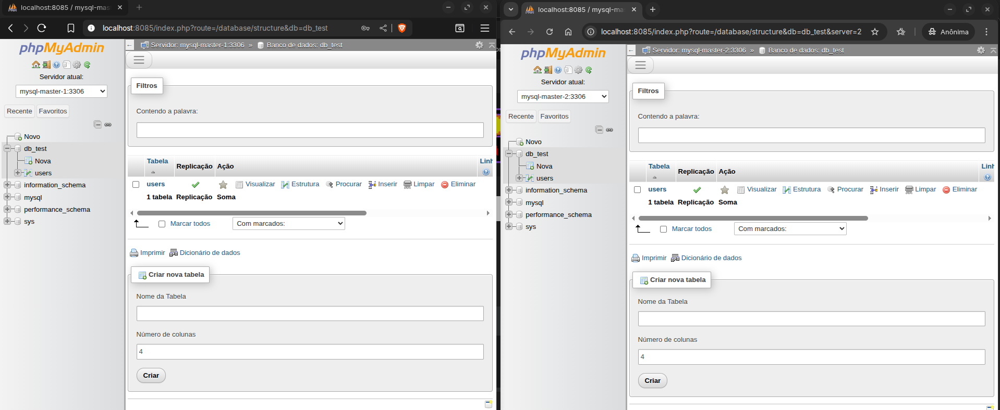

# 🐳 MySQL Master x Master Replication com Docker


Replicação bidirecional MySQL com Docker Compose - Dois servidores independentes replicando um do outro com **GTID** (Global Transaction IDs).Este projeto configura uma replicação MySQL Master x Master utilizando Docker Compose, com phpMyAdmin para administração.


## 📁 Estrutura do Projeto



```

phpmyadmin_mysql_master/

├── dev/                          # Ambiente de desenvolvimento (single docker-compose)## 🚀 Como usar

│   ├── docker-compose.yml        # Setup Docker local

│   ├── docker/### 1. Iniciar os containers

│   │   └── mysql/```bash

│   │       ├── my-simple.cnf     # Configuração Master 1 (dev)docker-compose up -d

│   │       └── my-simple-2.cnf   # Configuração Master 2 (dev)```

│   ├── setup-replication.sh      # Script de replicação (dev)

│   ├── check-replication.sh      # Monitoramento (dev)### 2. Configurar replicação automaticamente

│   └── test-failover-resilience.sh```bash

│./setup-replication.sh

├── prod/                         # Ambiente de produção (servidores separados)```

│   ├── server-1/                 # Master 1 (IP: 192.168.1.10)

│   │   ├── docker-compose.yml### 3. Verificar status da replicação

│   │   ├── .env```bash

│   │   ├── myql/./check-replication.sh

│   │   │   └── my-config-1.cnf   # Configuração Master 1```

│   │   └── exec/

│   │       └── setup-replication.sh## 🔧 Configuração

│   │

│   └── server-2/                 # Master 2 (IP: 192.168.1.20)### Serviços disponíveis:

│       ├── docker-compose.yml- **mysql-master-1**: MySQL 8.0 (apenas rede interna)

│       ├── .env- **mysql-master-2**: MySQL 8.0 (apenas rede interna)

│       ├── mysql/- **phpmyadmin**: Interface web (porta 8085 - única porta exposta)

│       │   └── my-config-2.cnf   # Configuração Master 2

│       └── exec/### Credenciais padrão:

│           └── setup-replication.sh- **Root password**: teste123

│- **Usuário de replicação**: replicador

└── README.md (este arquivo)- **Senha de replicação**: teste123

```

## 🌐 Acesso

## 🚀 Quick Start

- **phpMyAdmin**: http://localhost:8085 (✅ Único acesso externo)

### Desenvolvimento (Docker Local)- **MySQL Masters**: Apenas via rede interna do Docker (🔒 Isolados)


```bash> 📝 **Nota**: Os serviços MySQL não estão expostos externamente, evitando conflitos com outros projetos MySQL na porta 3306.

cd dev/

### 🔧 Acesso interno aos MySQL (se necessário):

# 1. Subir containers```bash

docker-compose up -d# Conectar ao Master 1

docker exec -it mysql-master-1 mysql -uroot -pteste123

# 2. Configurar replicação

./setup-replication.sh mysql-master-2# Conectar ao Master 2

docker exec -it mysql-master-2 mysql -uroot -pteste123

# 3. Acessar phpMyAdmin```

# http://localhost:8085

# Usuário: root | Senha: teste123### 🔗 Conectar outros projetos à mesma rede:

```Se precisar que outros containers acessem estes MySQL, adicione ao docker-compose.yml do outro projeto:

```yaml

### Produção (Servidores Separados)networks:

  default:

#### Server 1 (192.168.1.10)    external: true

```bash    name: phpmyadmin_mysql_master_mysql-network

cd prod/server-1```


# 1. Configurar variáveis## 📊 Monitoramento

cat > .env << EOF

DB_ROOT_PASSWORD=teste123### Verificar logs dos containers:

DB_PASSWORD=teste123```bash

EOFdocker-compose logs mysql-master-1

docker-compose logs mysql-master-2

# 2. Subir container```

docker-compose up -d

### Status detalhado da replicação:

# 3. Aguardar container ficar pronto```bash

sleep 30# Master 1

docker exec mysql-master-1 mysql -uroot -pteste123 -e "SHOW SLAVE STATUS\G"

# 4. Executar setup de replicação

cd exec# Master 2

./setup-replication.sh 192.168.1.20docker exec mysql-master-2 mysql -uroot -pteste123 -e "SHOW SLAVE STATUS\G"

``````


#### Server 2 (192.168.1.20)## 🛠️ Características da configuração

```bash

cd prod/server-2### Resistência a falhas:

- ✅ Detecção automática de falhas de rede

# 1. Configurar variáveis- ✅ Recuperação automática de logs corrompidos

cat > .env << EOF- ✅ Tratamento de conflitos de replicação

DB_ROOT_PASSWORD=teste123- ✅ GTID habilitado para rastreamento global

DB_PASSWORD=teste123- ✅ Checksums para integridade de dados

EOF- ✅ Timeouts otimizados para alta disponibilidade

- ✅ **Testado**: Resiliência comprovada em cenários de queda (veja `RELATORIO_TESTES_RESILIENCIA.md`)

# 2. Subir container

docker-compose up -d### Configurações de performance:

- ✅ Buffers otimizados para replicação

# 3. Aguardar container ficar pronto- ✅ InnoDB configurado para durabilidade

sleep 30- ✅ Auto-increment configurado para evitar conflitos

- ✅ Logs detalhados para troubleshooting

# 4. Executar setup de replicação

cd exec## 🧪 Testes de Resiliência

./setup-replication.sh 192.168.1.10

```Este projeto inclui testes automatizados para validar o comportamento do sistema em cenários de falha:


## 📋 Configuração dos Masters- **Teste 1**: Queda de Master 2 por 1 minuto

- **Teste 2**: Queda simultânea de ambos os masters por 1 minuto

### Master 1 Configuration (prod/server-1/myql/my-config-1.cnf)

### Executar testes:

```ini```bash

[mysqld]./test-failover-resilience.sh

# Identificação do servidor```

server-id = 1

bind-address = 0.0.0.0## 🚨 Troubleshooting

port = 3306

### Replication lag alto:

# Binary Logging (necessário para replicação)1. Verificar recursos do sistema

log-bin = mysql-bin2. Analisar slow query log

log-slave-updates = 13. Otimizar consultas problemáticas


# GTID Configuration### Erros de replicação:

gtid_mode = ON1. Executar: `./check-replication.sh`

enforce_gtid_consistency = ON2. Verificar logs: `docker-compose logs`

3. Reiniciar replicação se necessário:

# Auto-increment para evitar conflitos   ```bash

auto-increment-increment = 2   docker exec mysql-master-1 mysql -uroot -pteste123 -e "STOP SLAVE; START SLAVE;"

auto-increment-offset = 1   ```


# Charset### Reset completo:

character-set-server = utf8mb4```bash

collation-server = utf8mb4_unicode_cidocker-compose down -v

```docker-compose up -d

./setup-replication.sh

### Master 2 Configuration (prod/server-2/mysql/my-config-2.cnf)```


```ini## 📁 Estrutura do projeto

[mysqld]

# Identificação do servidor```

server-id = 2.

bind-address = 0.0.0.0├── docker-compose.yml          # Definição dos serviços

port = 3306├── .env                        # Variáveis de ambiente

├── setup-replication.sh       # Script de configuração automática

# Binary Logging├── check-replication.sh       # Script de monitoramento

log-bin = mysql-bin├── docker/

log-slave-updates = 1│   └── mysql/

│       ├── my.cnf             # Configuração MySQL Master 1

# GTID Configuration│       └── my-master-2.cnf    # Configuração MySQL Master 2

gtid_mode = ON

enforce_gtid_consistency = ON```


# Auto-increment para evitar conflitos## ⚠️ Importante

auto-increment-increment = 2

auto-increment-offset = 2- Esta configuração é para desenvolvimento/teste

- Para produção, ajuste as senhas e configurações de segurança

# Charset- Faça backups regulares dos dados

character-set-server = utf8mb4- Monitore o lag de replicação constantemente
collation-server = utf8mb4_unicode_ci
```

## 🔐 Segurança com Firewall

Abra apenas as portas necessárias:

```bash
# Server 1 - Permitir Master 2
sudo ufw allow from 192.168.1.20 to any port 3306

# Server 2 - Permitir Master 1
sudo ufw allow from 192.168.1.10 to any port 3306

# Bloquear acesso de outros IPs
sudo ufw deny from any to any port 3306
```

## 🧪 Verificar Status da Replicação

### Desenvolvimento
```bash
cd dev/
./check-replication.sh
```

### Produção - Server 1
```bash
docker exec mysql-master-1 mysql -uroot -pteste123 -e "SHOW SLAVE STATUS\G" | grep -E "(Slave_IO_Running|Slave_SQL_Running|Seconds_Behind_Master|Master_Host)"
```

### Produção - Server 2
```bash
docker exec mysql-master-2 mysql -uroot -pteste123 -e "SHOW SLAVE STATUS\G" | grep -E "(Slave_IO_Running|Slave_SQL_Running|Seconds_Behind_Master|Master_Host)"
```

**Saída esperada:**
```
Slave_IO_Running: Yes
Slave_SQL_Running: Yes
Seconds_Behind_Master: 0
Master_Host: 192.168.1.20 (ou 192.168.1.10)
```

## 📊 Testes de Resiliência

### Desenvolvimento
```bash
cd dev/
./test-failover-resilience.sh
```

Testa:
1. **Teste 1**: Queda do Master 2 por 1 minuto → Recuperação automática
2. **Teste 2**: Queda de ambos os masters por 1 minuto → Sincronização automática

### Resultado esperado
```
✅ Teste 1: PASSOU - Dados sincronizados, zero perda
✅ Teste 2: PASSOU - Registros preservados, sync automática
```

## 🔄 Replicação Bidirecional

A arquitetura é simples e robusta:

```
┌──────────────────┐          ┌──────────────────┐
│  MySQL Master 1  │  ←→      │  MySQL Master 2  │
│  Server-ID: 1    │   GTID   │  Server-ID: 2    │
│  ID's: 1,3,5,7.. │  Based   │  ID's: 2,4,6,8.. │
└──────────────────┘          └──────────────────┘
```

- **GTID-based**: Automático e robusto
- **Auto-increment inteligente**: Sem conflitos de PK
- **Log-slave-updates**: Propaga mudanças bidirecionalmente
- **Sincronização < 5 segundos**: Praticamente instantâneo

## 🚨 Troubleshooting

### Problema: Slave_IO_Running = Connecting

```bash
# Verificar conectividade
ping 192.168.1.20

# Testar acesso MySQL
mysql -h192.168.1.20 -ureplicador -pteste123

# Ver logs
docker logs mysql-master-2 | tail -50
```

### Problema: Slave_SQL_Running = No

```bash
# Ver erro
docker exec mysql-master-1 mysql -uroot -pteste123 -e "SHOW SLAVE STATUS\G" | grep "Last_SQL_Error"

# Reiniciar replicação
docker exec mysql-master-1 mysql -uroot -pteste123 -e "STOP SLAVE; START SLAVE;"
```

### Problema: Replicação fora de sincronia

```bash
# Resetar replicação (cuidado: zera dados de replicação)
docker exec mysql-master-1 mysql -uroot -pteste123 -e "RESET SLAVE ALL;"

# Reconfigurar
cd prod/server-1/exec
./setup-replication.sh 192.168.1.20
```

## 💾 Backups

### Backup Completo
```bash
# Master 1
docker exec mysql-master-1 mysqldump -uroot -pteste123 --all-databases > backup_master1.sql

# Master 2
docker exec mysql-master-2 mysqldump -uroot -pteste123 --all-databases > backup_master2.sql
```

### Restaurar Backup
```bash
docker exec -i mysql-master-1 mysql -uroot -pteste123 < backup_master1.sql
```

## 🔧 Variáveis de Ambiente

### .env (Server 1 e Server 2)
```
DB_ROOT_PASSWORD=teste123
DB_PASSWORD=teste123
```

Altere as senhas em produção!

## 📚 Referências

- [MySQL Replication](https://dev.mysql.com/doc/refman/8.0/en/replication.html)
- [GTID Replication](https://dev.mysql.com/doc/refman/8.0/en/replication-gtids.html)
- [Docker Compose](https://docs.docker.com/compose/)

## ✅ Checklist de Produção

- [ ] Alterar senhas padrão em `.env`
- [ ] Configurar firewall (ufw/iptables)
- [ ] Implementar backups automáticos
- [ ] Configurar monitoramento (Prometheus/Grafana)
- [ ] Testar failover em ambiente controle
- [ ] Documentar IPs e portas da infraestrutura
- [ ] Configurar SSL/TLS para conexões

## 📞 Suporte

Para issues ou dúvidas, consulte:
1. Logs: `docker logs mysql-master-1`
2. Status: `./check-replication.sh`
3. Documentação: `README.md`

---

**Versão**: 0.5  
**Última atualização**: 31 de outubro de 2025  
**Status**: BETA, revisar e melhorar antes de subir para prod.
